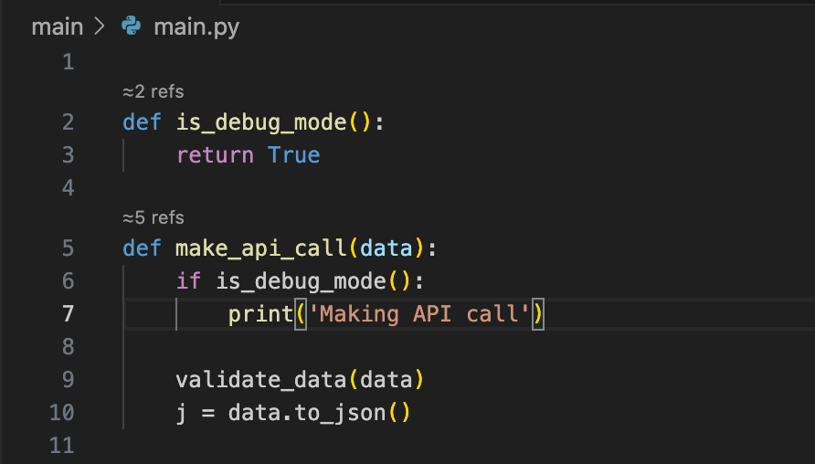

# Tooltitude for Python

Tooltitude for Python is a vscode extension providing productivity language services for Python. The extension is being actively developed so stay tuned for new features.

## Languge Service Features
- CodeLens for top level function references
- CodeLens for top level class references

## Source root discovery
We automatically add to list of Python source directories the following:
- Workspace roots
- Any directory which contains either requirements.txt or pyproject.toml
- Within the above directories, src and tests directories

Note: if you have any problems with it, or your use case isn't covered well, please, report to https://github.com/tooltitude/support-py

## Data
We collect anonymous usage data in order to improve our products. To opt-out of data collections, turn off application-wide telemetry setting in Visual Studio Code as directed by the Visual Studio Code documentation before installing the extension, or at any time after the installation: https://code.visualstudio.com/docs/supporting/faq#_how-to-disable-telemetry-reporting Our extension respects this global setting as directed by extension guidelines published by Microsoft. You could read more about our privacy policy here: https://www.tooltitude.com/privacy

## Support Resources
* You could ask for help or suggest a feature by creating an issue in this repository: https://github.com/tooltitude/support-py/issues/new/choose
* You could join our Discord community: https://discord.gg/f9MHBXsVwr

## Other Links
* Visit our site: https://www.tooltitude.com/
* Follow us on X: https://twitter.com/tooltitude
